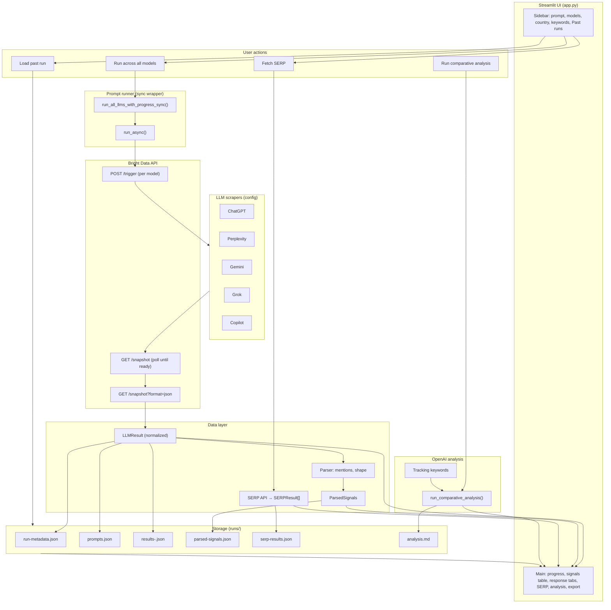

# LLM Mentions Tracker — Architecture & Data Flow

This document describes the main components and how data moves through the system. Use it to walk through the app in a tutorial.

---

## High-level flow

```
┌─────────────────────────────────────────────────────────────────────────────────┐
│                              STREAMLIT UI (app.py)                               │
│  Sidebar: prompt, models, country, keywords │ Main: progress → table → tabs      │
└───────────────────────────────┬─────────────────────────────────────────────────┘
                                │
        ┌───────────────────────┼───────────────────────┐
        ▼                       ▼                       ▼
┌───────────────┐     ┌─────────────────┐     ┌─────────────────┐
│  Run prompt   │     │  Fetch SERP     │     │  Load past run   │
│  (single)     │     │  (optional)     │     │  (sidebar)       │
└───────┬───────┘     └────────┬────────┘     └────────┬────────┘
        │                      │                       │
        ▼                      ▼                       │
┌───────────────┐     ┌─────────────────┐             │
│ Prompt Runner │     │   SERP API      │             │
│ (parallel)    │     │   (Bright Data) │             │
└───────┬───────┘     └────────┬────────┘             │
        │                      │                       │
        ▼                      │                       ▼
┌───────────────┐              │               ┌─────────────────┐
│ Bright Data   │              │               │   Run Loader    │
│ Web Scraper   │              │               │   (runs/ dir)   │
│ API (per LLM) │              │               └────────┬────────┘
└───────┬───────┘              │                        │
        │                      │                        │
        ▼                      ▼                        ▼
┌─────────────────────────────────────────────────────────────────┐
│                    NORMALIZED RESULTS (LLMResult, SERPResult)     │
└───────────────────────────────┬─────────────────────────────────┘
                                │
                                ▼
┌─────────────────────────────────────────────────────────────────┐
│  PARSER  (mentions, answer shape)  →  ParsedSignals               │
└───────────────────────────────┬─────────────────────────────────┘
                                │
        ┌───────────────────────┼───────────────────────┐
        ▼                       ▼                       ▼
┌───────────────┐     ┌─────────────────┐     ┌─────────────────┐
│ Signals table │     │ Response tabs   │     │ Save to runs/   │
│ (summary)     │     │ (per model)     │     │ (auto + SERP,   │
└───────────────┘     └─────────────────┘     │  analysis)      │
                                              └────────┬────────┘
                                                       │
                                ┌──────────────────────┘
                                ▼
┌─────────────────────────────────────────────────────────────────┐
│  OPTIONAL: OpenAI comparative analysis (keyword-focused)         │
│  → analysis.md saved to run; loaded when viewing past run       │
└─────────────────────────────────────────────────────────────────┘
```

---

## Component diagram (Mermaid)

You can render this in any Mermaid-supported viewer (e.g. GitHub, VS Code with Mermaid extension, or [mermaid.live](https://mermaid.live)).



---

## Data flow (step-by-step)

### 1. User starts a run

- User enters a **prompt**, selects **models** (e.g. ChatGPT, Perplexity, Gemini, Grok, Copilot), and optionally **country** and **tracking keywords**.
- Clicks **“Run across all models”**.

### 2. Prompt runner (parallel execution)

- **`run_all_llms_with_progress_sync()`** runs in the Streamlit process and calls **`run_async()`** to drive async code.
- For each selected model, the app starts one async task that:
  - **Triggers** the Bright Data Web Scraper API (`POST /trigger` with `dataset_id` for that LLM).
  - **Polls** the snapshot until status is ready (`GET /snapshot/{id}`).
  - **Downloads** the result (`GET /snapshot/{id}?format=json`).
- Tasks run in parallel; as each finishes, a callback updates the UI (e.g. “✅ ChatGPT — Complete”).
- Results are normalized into **`LLMResult`** (model name, prompt, answer text, status, etc.).

### 3. Bright Data API (per model)

- **Config** (`src/config/scrapers.py`): each LLM has a `dataset_id` and URL.
- **Trigger body**: `{"input": [{"url": "...", "prompt": "...", "index": 1}]}`.
- **Response**: list of **`LLMResult`** (one per model), in consistent shape regardless of scraper.

### 4. Parser

- **Input**: `LLMResult.answer_text` + list of **tracking keywords**.
- **Output**: **`ParsedSignals`** per model:
  - **Mentions**: which keywords appear in the answer and (if in a list) position.
  - **Answer shape**: ranked list, narrative, categories, or hybrid.
- Used for the **signals summary table** and for highlighting keywords in the response tabs.

### 5. Display and storage

- **Signals table**: one row per model (mentioned tools, position, shape, word count).
- **Response tabs**: one tab per model; answer text with **tracking keywords highlighted**.
- **Auto-save**: run is written to **`runs/<timestamp>/`** with:
  - `run-metadata.json`, `prompts.json`, `results-<model>.json`, `parsed-signals.json`.
- **`last_run_id`** is stored in session so later SERP and analysis can be saved into this run.

### 6. Optional: SERP

- User clicks **“Fetch SERP for this query”**.
- **SERP API** (Bright Data) is called with the same query (and country); returns top organic results.
- Results shown in the SERP expander; if **`last_run_id`** is set, **`serp-results.json`** is written to that run folder.

### 7. Optional: Comparative analysis

- User clicks **“Run comparative analysis with OpenAI”**.
- **Tracking keywords** + **query** + **SERP snippets** + **LLM answers** are sent to OpenAI.
- The model returns a **keyword-focused** analysis (who mentioned which terms, gaps, recommendations).
- Shown in the UI; if **`last_run_id`** is set, **`analysis.md`** is written to that run folder.

### 8. Past runs

- **Sidebar** lists run directories under **`runs/`** (from **`RUNS_DIR`**).
- User clicks a run → **run loader** reads `run-metadata.json`, `results-*.json`, `parsed-signals.json`, `serp-results.json` (if present), `analysis.md` (if present).
- Loaded data is put into session state; **`last_run_id`** is set to that run so any new SERP or analysis still attaches to it.

---

## Key files (reference)

| Role | Path |
|------|------|
| UI entrypoint | `app.py` |
| Run storage root | `runs/` (via `RUNS_DIR` in `src/runner/bulk_runner.py`) |
| Bright Data client | `src/api/bright_data.py` |
| SERP client | `src/api/serp.py` |
| Scraper config | `src/config/scrapers.py` |
| Tracking keywords default | `src/config/keywords.py` |
| Models (LLMResult, ParsedSignals, SERPResult) | `src/models.py` |
| Parser (mentions, shape) | `src/parser/` |
| Prompt runner + bulk runner | `src/runner/prompt_runner.py`, `src/runner/bulk_runner.py` |
| Run loader | `src/run_loader.py` |
| OpenAI analysis | `src/analysis/openai_analyzer.py` |

---

## Summary for the tutorial

1. **One prompt, many LLMs** — same query is sent to several AI products in parallel via Bright Data’s scrapers.
2. **Normalized results** — every answer becomes an `LLMResult`; the parser turns it into `ParsedSignals` for the table and highlights.
3. **Tracking keywords** — drive both the parser (who mentioned what) and the OpenAI analysis (keyword-focused summary).
4. **Runs are first-class** — every run is saved under `runs/<timestamp>/`; SERP and analysis are appended when the user fetches them; past runs are loadable from the sidebar.
5. **Optional SERP and OpenAI** — compare traditional search (SERP) and get a written analysis (OpenAI) tied to the same run and keywords.
